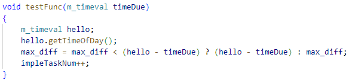
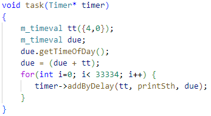
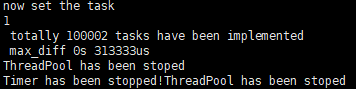

<h2 align='center'>mutty</h2>

#### 功能

* 支持任意参数的定时函数，返回类型目前仅支持void。
* 定时任务并发量超10w/s，延时控制在0.5s以内（310ms），支持微秒级定时。
* 自定义了延时队列DelayQueue, 线程池ThreadPool等组件，可拆分出来使用。

#### 组件说明

* TimingWheel

  分层级时间轮，后一级时间轮分片时间为前一级时间轮分片时间 × 时间格数量，定时任务超出当前时间轮表示最大时间时，自动创建后一级时间轮。

* DelayQueue

  由大顶堆实现，通过offer接口加入延时任务，通过poll接口获取到期任务，利用自定义的自旋锁同步poll和offer操作，减少了mutex带来的线程切换开销。

* ThreadPool

  可以自定义线程池消费者线程数量，通过互斥锁和条件变量控制线程同步，线程池关闭后，能阻止用户添加新任务，并在完成任务队列剩余的任务才关闭线程池。

#### 接口说明

* ```c++
  Timer(m_timeval tickMs, int wheelSize, m_timeval timeout, int threadNum));
  ```

  Timer时间轮定时器构造函数，tickMs为第一级时间轮的分片时间；wheelSize表示每一级时间轮的时间格数量；timeout是内部时钟IO复用模型select的超时时间；threadNum为线程池消费者线程数量。

* ```c++
  void start();
  ```

  启动时间轮定时器，定时器构建完成后，调用该函数启动定时器，启动后定时器便可接受延时任务。

* ```c++
  template<typename Func, typename ... Args>
  void addByDelay(const m_timeval& delayTime, const Func& func, Args&& ... args)
  ```

  定时器添加延时任务的接口，delayTime为延迟时间，func为延时任务的函数指针，args...为可变参数的参数包。

* ```c++
  void shutdown()
  ```

  关闭时间轮定时器，调用后，停止定时器内部的所有组件，并在线程池任务队列剩余任务执行完成后退出。

#### 实验结果

* 实验测试函数

  

  测试函数为获取当前的时间，与预约的时间计算时间差。

* 定时任务结果

  

  定时任务的测试函数，3个线程，每个线程添加了33334个任务，共有100002个任务。

  

  1秒内定时10万个测试函数，通过打印结果可知延时在310ms左右